# BTC Price Forecast With LSTM and PPO

[](https://www.python.org/)
[](https://www.tensorflow.org/)
[](LICENSE)

This repository studies BTC/USDT price forecasting from two angles:

- A Bidirectional LSTM for next-step price prediction
- An MC-Dropout LSTM for prediction intervals and uncertainty
- A PPO trading agent for policy learning on the same feature space

## Motivation

I have followed crypto since 2015 (back then I even posted a few Bitcoin videos on YouTube during 2015–2016) and the topic has stayed with me ever since. During the COVID pandemic I picked up trading and chart analysis more seriously, and when I started studying machine learning and deep learning in 2024 the natural next step was to try a forecasting project on Bitcoin.

The trigger for the first version of this project was a class. While I was learning LSTMs in deep learning, my machine learning professor, Ali Muhamed Ali, introduced our group to one of his own papers: Wang, Zhuang, Chérubin, Ibrahim, and Muhamed Ali (2019), *Medium-Term Forecasting of Loop Current Eddy Cameron and Eddy Darwin Formation in the Gulf of Mexico With a Divide-and-Conquer Machine Learning Approach* ([JGR Oceans, 10.1029/2019JC015172](https://doi.org/10.1029/2019JC015172)). That timing made me want to take a similar modeling philosophy and apply it in a domain I actually cared about.

### How This Project Relates To The Paper

The paper forecasts sea surface height in the Gulf of Mexico with a divide-and-conquer LSTM that uses EOF / principal components, partitioned subregions, and a smoothing function across partition boundaries. None of that machinery is reproduced here. This repository is a one-dimensional financial time-series project on BTC OHLCV, with technical indicators in [src/features.py](src/features.py) and recurrent models in [src/lstm_model.py](src/lstm_model.py).

What carries over is the underlying ML question: can an LSTM-family model learn enough temporal structure from past sequences to make useful forecasts beyond the immediate next step, and how fast does that skill decay as the horizon grows? That framing is what shaped the unseen 1-week, 1-month, and 3-month evaluations described in [Unseen-Data Validation](#unseen-data-validation), as well as the rolling forward forecast in the notebook. The paper is a useful precedent for medium-horizon recurrent forecasting under compounding error, not a structural template. Specific choices like the `LOOKBACK = 60` input window and the BiLSTM / MC-Dropout / PPO stack are project-specific decisions, not transcriptions from the paper.

### From The First Version To The Current One

The first version of this project trained well and tested well, but it generalized badly on truly unseen data. At the time I did not have a good explanation for the gap; in hindsight the most likely cause was overfitting: the model had latched onto patterns specific to the training and held-out test windows and had no real handle on regime change or compounding error over longer horizons.

I recently came back to the project to address that, this time with help from Claude Code, and the current version is the result of that revisit. Concretely, the new version adds:

- **An honest unseen-data protocol.** Performance is now reported on a strictly held-out 15-minute BTC window over three horizons (1 week, 1 month, 3 months), so generalization failures are visible instead of hidden behind a single train/test split.
- **MC-Dropout uncertainty.** A second LSTM exposes prediction intervals and confidence bands. In the latest run it cuts unseen RMSE by ~41% over 1 week and ~60% over 1 month versus the deterministic BiLSTM, while also flagging when the model is unsure.
- **A richer feature space.** The feature module now includes RSI, MACD, signal line, SMA(10/50), Bollinger Bands, ATR, OBV, and stochastic oscillator instead of price alone.
- **A PPO trading agent** on the same feature space, so the project compares supervised next-step forecasting with policy learning on the same context.
- **A 500-step rolling future forecast** that is intentionally presented as a failure mode: long-horizon autoregressive prediction drifts along an unrealistically smooth path, which makes the limitation explicit rather than hiding it.
- **Reproducible documentation.** The figures and metrics in this README are exported by the notebook into `assets/readme/`, so the documentation stays tied to actual model output and refreshes whenever the notebook is rerun end-to-end.

The headline result is closer to what the paper anticipated for recurrent medium-term forecasting: short and medium-horizon prediction can be genuinely useful, but skill decays quickly as the horizon grows. The current models do well at 1 week and 1 month and degrade sharply by 3 months, which is both consistent with that picture and a much more honest answer than the first version of this project was able to give.

## What The Project Does

The pipeline pulls Binance Vision candlestick data, engineers technical indicators, trains sequential models on BTC/USDT 15-minute candles, and compares deterministic forecasting against uncertainty-aware forecasting. The later notebook sections also train a PPO agent, generate a rolling future forecast, and test model quality on unseen months.

Core feature set:

- OHLCV inputs from Binance Vision
- RSI, MACD, signal line, SMA(10), SMA(50)
- Bollinger Bands, ATR, OBV, and stochastic oscillator

## Current Saved Results

These are the metrics from the latest exported notebook run in `assets/readme/`. They refresh whenever the notebook is rerun end-to-end.

| Model | RMSE (USD) | MAE (USD) | MAPE (%) |
| --- | ---: | ---: | ---: |
| Bidirectional LSTM | 991.02 | 655.65 | 1.27 |
| MC-Dropout LSTM | 849.99 | 549.38 | 1.13 |

Takeaways from this run:

- The plain BiLSTM tracks short-term BTC direction reasonably well, but it is visibly smoother than the realized path and tends to lag sharper turns.
- MC-Dropout is the strongest forecasting result in this saved run: it improves RMSE by about 14%, MAE by 16%, and MAPE by 11% while also producing interpretable confidence bands.
- The training curves for both LSTM variants converge cleanly without obvious late-epoch overfitting, which suggests the models are learning useful short-horizon structure rather than just memorizing the training window.

## Unseen-Data Validation

The most important check in the project is the truly unseen 15-minute BTC window. The latest export shows that MC-Dropout generalizes much better over short and medium horizons, but both models lose calibration as the horizon stretches and market regime drift accumulates.

| Horizon | Model | RMSE (USD) | MAE (USD) | MAPE (%) |
| --- | --- | ---: | ---: | ---: |
| 1 Week | Bidirectional LSTM | 723.66 | 697.03 | 1.12 |
| 1 Week | MC-Dropout LSTM | 424.48 | 372.86 | 0.60 |
| 1 Month | Bidirectional LSTM | 920.98 | 881.71 | 1.33 |
| 1 Month | MC-Dropout LSTM | 364.01 | 291.35 | 0.45 |
| 3 Months | Bidirectional LSTM | 4,978.68 | 4,036.04 | 4.35 |
| 3 Months | MC-Dropout LSTM | 5,306.89 | 3,992.45 | 4.17 |

What stands out:

- Over 1 week, MC-Dropout cuts RMSE by roughly 41% and MAE by 47%, which matches the tighter visual fit in the unseen overlay.
- Over 1 month, the gap gets even larger: MC-Dropout remains much closer to the realized level and direction, while the deterministic BiLSTM sits persistently low.
- Over 3 months, both models degrade sharply. MC-Dropout is still slightly better on MAE and MAPE, but it becomes worse on RMSE, which signals that long-horizon regime changes dominate both models.

## Figures

### BTC/USDT Regime Overview

This figure gives context before modeling. The most informative panel is the return histogram: 15-minute BTC returns are tightly centered near zero but still show fat tails, which means the series is dominated by many quiet bars interrupted by occasional large jumps. That is exactly the setting where uncertainty-aware forecasting can add value.

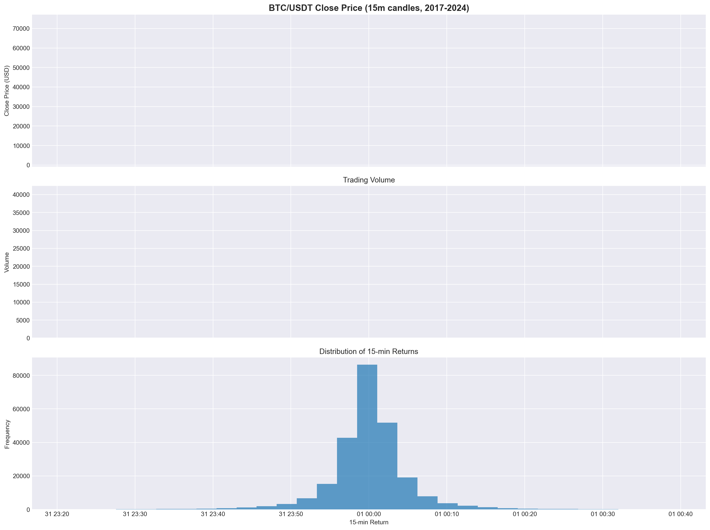

### Bidirectional LSTM Training

Train and validation loss both fall quickly and then flatten, with no strong late-epoch divergence. That is a good sign that the model is learning useful short-horizon structure without obvious overfitting.

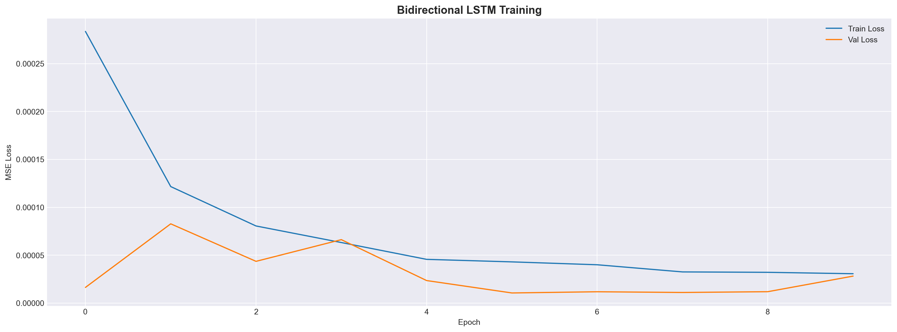

### Bidirectional LSTM Test Predictions

The deterministic model follows short-term momentum reasonably well, but its predictions are visibly smoother than the realized series. That smoothing helps denoise the path, yet it also means the model underreacts around sharper inflections.

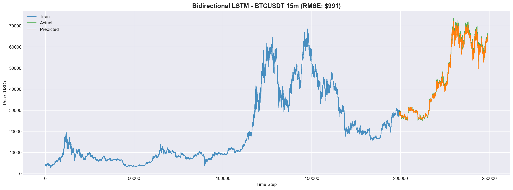

### MC-Dropout Training

The MC-Dropout model shows a similar convergence pattern, although the validation curve is noisier because dropout remains active and makes optimization more stochastic. Even so, the model settles into a stable low-loss region.

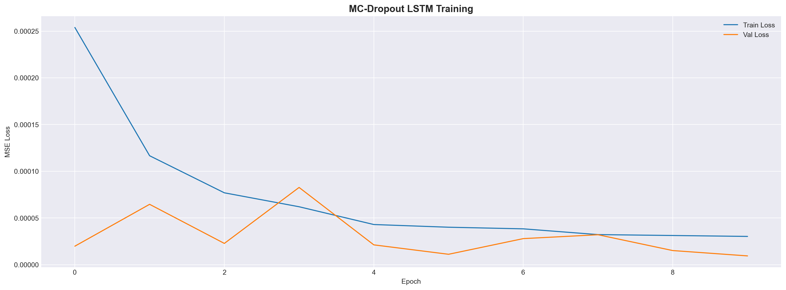

### MC-Dropout Uncertainty Bands

This is the strongest forecasting plot in the repository right now. The mean prediction stays close to the realized path, and the 95% interval widens during more volatile segments, which makes the forecast more useful for risk-aware interpretation instead of just point prediction.

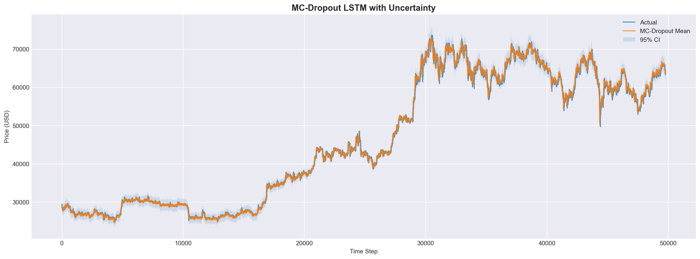

### PPO Trading Backtest

The PPO portfolio curve grows well above the starting capital, but it also shows large swings and deep drawdowns. That makes the result interesting, though not yet robust enough to treat as a production-grade trading strategy. The notebook also reuses the same transformed context used for training, so this backtest should be read as optimistic.

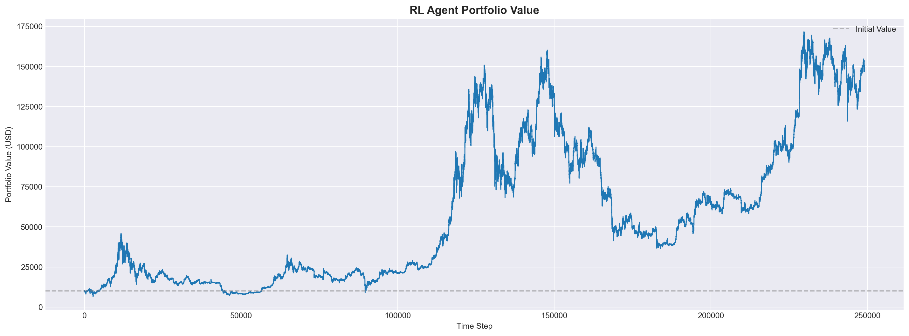

### 500-Step Future Forecast

The recursive 500-step forecast drifts downward in an unrealistically smooth path. That makes it useful mainly as a failure-mode illustration: short-horizon inference is much more credible here than long-horizon autoregressive forecasting.

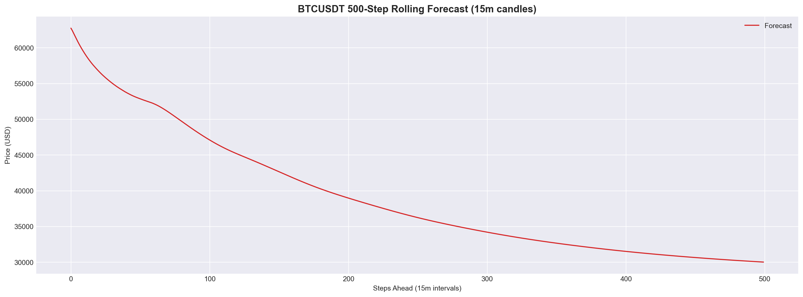

### Unseen Data Overlays

These three plots are the clearest test of generalization:

- Over 1 week, MC-Dropout stays much closer to the realized series than the deterministic BiLSTM.
- Over 1 month, that advantage becomes even more obvious: the BiLSTM sits persistently low while the MC mean tracks level and direction more accurately.
- Over 3 months, both models begin to underestimate the later high-price regime, showing that regime drift becomes the main challenge.

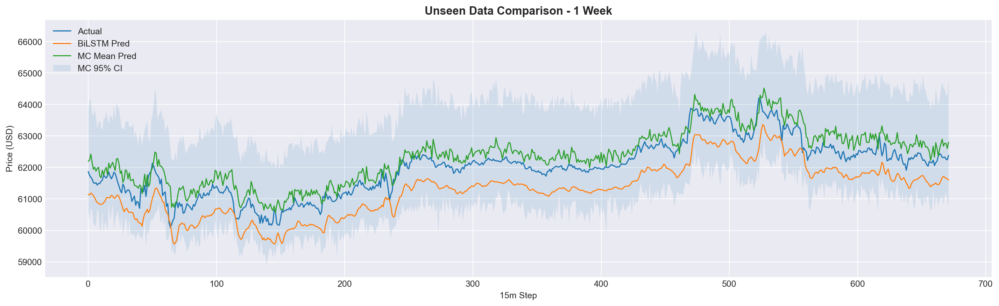

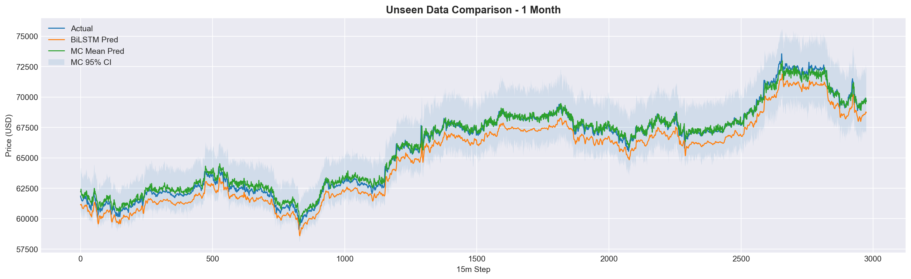

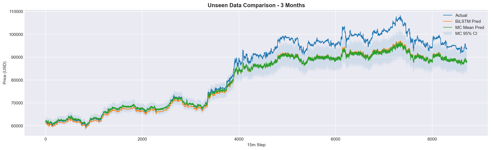

### Precision Decay And Rolling Error

The unseen RMSE bar chart summarizes the main generalization result: MC-Dropout is substantially better over 1 week and 1 month, but its advantage disappears by 3 months. The rolling-MAE plot shows the same story dynamically, with errors rising sharply once the unseen window moves into a harder regime.

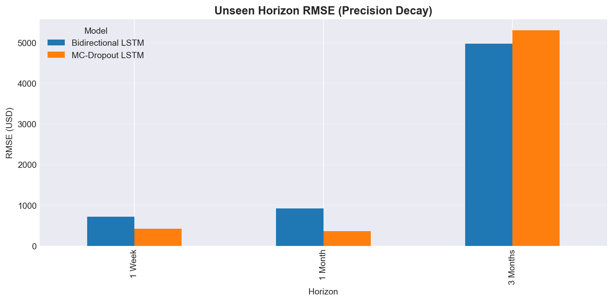

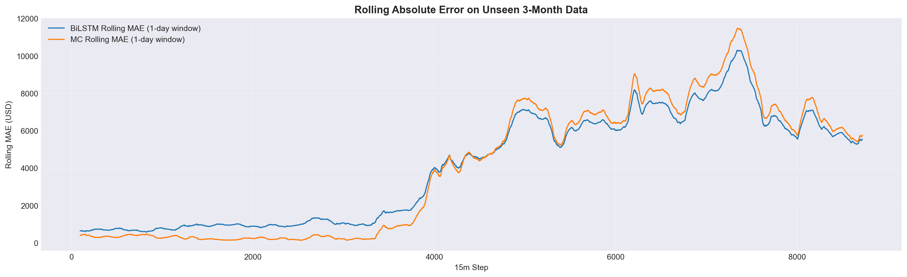

## Reproducible Documentation Assets

Running the notebook will regenerate the figures and CSV summaries below:

- `assets/readme/ppo_portfolio_backtest.png`
- `assets/readme/future_forecast_500_step.png`
- `assets/readme/unseen_overlay_1_week.png`
- `assets/readme/unseen_overlay_1_month.png`
- `assets/readme/unseen_overlay_3_months.png`
- `assets/readme/unseen_rmse_bars.png`
- `assets/readme/rolling_mae_unseen.png`
- `assets/readme/model_comparison.csv`
- `assets/readme/unseen_metrics.csv`

That keeps the README tied to actual notebook outputs instead of manually copied numbers.

## Repository Layout

```text
btc-lstm-forecast/
├── README.md
├── requirements.txt
├── assets/
│   └── readme/                  # exported notebook figures for documentation
├── notebooks/
│   └── crypto_prediction.ipynb  # main experiment notebook
├── src/
│   ├── data_loader.py
│   ├── features.py
│   ├── lstm_model.py
│   ├── rl_env.py
│   └── utils.py
├── data/                        # downloaded market data (gitignored)
└── models/                      # trained weights (gitignored)
```

## Getting Started

```bash
git clone https://github.com/SiegKat/btc-lstm-forecast.git
cd btc-lstm-forecast
pip install -r requirements.txt
```

Then open the notebook:

```bash
cd notebooks
jupyter notebook crypto_prediction.ipynb
```

## Notes And Limitations

- The forecasting models use only price and volume derived indicators.
- MC-Dropout is the best short-horizon forecaster in the current run, but neither model is robust to multi-month regime drift.
- The PPO section currently reuses the same transformed context as training, so it should not be treated as a strict out-of-sample trading result.
- Auto-regressive long-horizon forecasts accumulate error quickly.
- This project is educational and research-oriented, not financial advice.

## License

MIT
